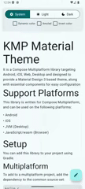
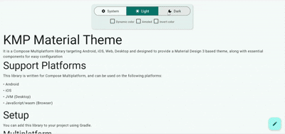
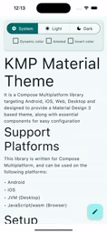

# 🌗 KMP Material Theme

[](https://central.sonatype.com/artifact/io.github.tarifchakder.materializekmp/material-theme)  
[](LICENSE)  
[](https://kotlinlang.org)  
[](https://github.com/JetBrains/compose-multiplatform)


---

## ✨ Overview

**KMP Material Theme** is a [Compose Multiplatform](https://github.com/JetBrains/compose-multiplatform) library that provides a **Material Design 3–based theme system** and essential components.

It enables consistent UI styling across multiple platforms:

- 📱 **Android**
- 🍏 **iOS**
- 💻 **JVM (Desktop)**
- 🌐 **JavaScript / Wasm (Browser)**

---

## 🖥️ Demo

|              Android               |               Web               |            IOS             |
|:----------------------------------:|:-------------------------------:|:--------------------------:|
|  |  |  |

---

## ⚙️ Installation

### Gradle (Multiplatform)

Add the dependency to your `commonMain` source set:

```kotlin
commonMain {
    dependencies {
        implementation("io.github.tarifchakder.materializekmp:material-theme:1.0.5")
    }
}
```

### Version Catalog

```toml
[versions]
materialtheme = "1.0.5"

[libraries]
material-theme = { module = "io.github.tarifchakder.materializekmp:material-theme", version.ref = "materialtheme" }
```

# Usage
Please check sample App.kt and DynamicTheme.kt class

## 📦 Features
•	🎨 Material Design 3 theming
•	🌙 Dark & light themes
•	🖌️ Dynamic color palette support
•	⚡ Optimized for Compose Multiplatform (Android, iOS, Desktop, Web/Wasm)
•	🔧 Easy integration with Gradle Version Catalogs

## License
MaterializeKMP is licensed under the MIT License.
This library draws inspiration from the Material Color Palette by the Material Foundation. For details on their licensing, see their LICENSE.
[LICENSE](material-theme-kit/src/commonMain/kotlin/io/github/tarifchakder/materializekmp/materialcolor/LICENSE)

## Contributing
Contributions are welcome! Please check out the contributing guidelines for more information on how to get involved.

If you have an idea for a new feature or an enhancement, follow these steps to submit a pull request:
1.	Fork the repository
Click the Fork button at the top-right of the repo to create your own copy.
2.	Create a new branch

```git checkout -b feature/my-new-feature```


